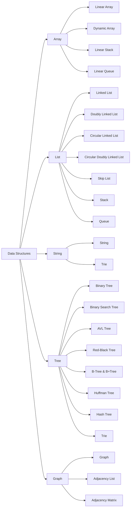

# Description

+ 数据结构(DS.)和算法(Algo.)三种实现方式:Cpp, C, Java
+ 📖主要内容:
  - Array, List, String, Tree, Graph;
  - Search & Sort;
  - 先后递归, 矩阵运算
  - 摊还分析, 动态规划, 贪心策略
  - 字符串匹配, 最短路径问题
  - NP完全性, 近似算法
+ 🚀适用: 
  - 考研党复习408的DS part
  - 工作党回顾Algo面试基础

# structure

<!-- todo: 增加/修改更多内容 -->

# environment

+ system: Arch Linux x86_64
+ compiler: g++/gcc 15.2.1 or clang(cpp::std=c++23), openjdk-24
+ Build:cmake 4.1.1/make 4.4.1
+ UnitTest: google test framework
+ IDE/PDE: vscode/lazyvim(neovim)

# details